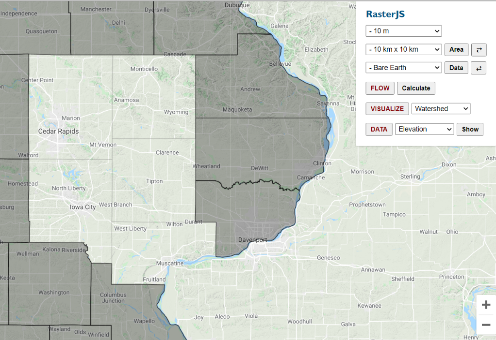
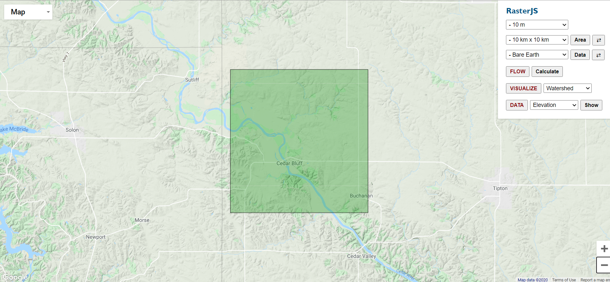

<h1 align="center">RasterJS

<h3 align="center">
  Towards Progressive Geospatial Information Processing on Web Systems: A Case Study for Watershed Analysis in Iowa
</h3>
 

## Table of Contents

- [Introduction](#introduction)
- [How To Use](#how-to-use)
- [Use Cases](#use-cases)
- [Feedback](#feedback)
- [Future Work](#future-work)
- [Acknowledgements](#acknowledgements)

## Introduction

Geographic Information Systems (GIS) are available as stand-alone desktop applications as well as web platforms for vector- and raster-based geospatial data processing and visualization. While each approach offers certain advantages, limitations exist that motivate the development of hybrid systems that will increase the productivity of users for performing interactive data analytics using multidimensional gridded data. Web-based applications are platform-independent, however, require the internet to communicate with servers for data management and processing which raises issues for performance, data integrity, handling, and transfer of massive multidimensional raster data. On the other hand, stand-alone desktop applications can usually function without relying on the internet, however, they are platform-dependent, making distribution and maintenance of these systems difficult. This project presents RasterJS, a hybrid client-side web library for geospatial data processing that is built on the Progressive Web Application (PWA) architecture to operate seamlessly in both Online and Offline modes. A packaged version of this system is also presented with the help of Web Bundles API for offline access and distribution. RasterJS entails the use of latest web technologies that are supported by modern web browsers, including Service Workers API, Cache API, IndexedDB API, Notifications API, Push API, and Web Workers API, in order to bring geospatial analytics capabilities to large-scale raster data for client-side processing. Each of these technologies acts as a component in the RasterJS to collectively provide a similar experience to users in both Online and Offline modes in terms of performing geospatial analysis activities such as flow direction calculation with hydro-conditioning, raindrop flow tracking, and watershed delineation. A large-scale case study is included in the study for watershed analysis to demonstrate the capabilities and limitations of the library. The framework further presents the potential to be utilized for other use cases that rely on raster processing, including land use, agriculture, soil erosion, transportation, and population studies.

## Use Cases

The system does not require external software framework knowledge to maintain as it relies on vanilla JavaScript and default JS Web APIs. From a user standpoint, the user interface is responsive and intuitive to enable associates of any technical proficiency level to use the system to its full potential without requiring training and previous expertise. The interface shown in the following figures summarizes the map view and user control panel. The user can navigate on the map with the help of panning and zooming. The control panel gives the user the ability to select the values for resolution, area, and elevation for georeferencing. Based on the selected values for these parameters, the selection window appears on the interface which can be moved around for the selection of the area of interest. The georeferenced image will be placed inside this selected area with the watershed boundary or raindrop flow overlaid on top. In Online mode, Google Maps view is displayed whereas in Offline mode OpenStreetMaps tiles are used to construct the map with a reduced extent and restricted zoom levels.

Currently, this repository presents only the Online Mode. Full version that includes the Offline and Web Bundle Modes will be released soon.

### Default view in online mode

### Selection window after selecting the values of the parameters

### Overlaying of the georeferenced image

### Watershed in the georeferenced image

### Watershed in the map context

### Raindrop Flow Tracker in the georeferenced image

## Future Work

The use case serves as a proof of concept with selected geospatial analytics tools for showcasing its utility in research and operational capacities and does not intend to be a comprehensive web GIS. The RasterJS will be updated as new web technologies emerge and existing ones improve. Web Assembly is a technology that can be incorporated to improve the performance of the system. The development of the RasterJS has opened the door for exploring peer to peer geospatial data distribution using WebRTC. For advanced data visualization approaches, technologies like WebGL can play an important role. WebCL is another technology that can be used for improving the performance of the application especially when the scope of the application will be extended beyond Iowa case study which would require the processing of a large number of images for georeferencing. Other than hydrological analysis, the application can be extended to other areas (e.g., urban planning, transportation, population studies, agriculture) by introducing more analytical abilities. Furthermore, several other raster data formats (e.g., GeoPackage, ArcGrid, ImageMosaic) can be supported to encompass a wide array of use cases.

## Feedback
Feel free to send us feedback by filing an issue.

## Acknowledgements
This project is developed by the University of Iowa Hydroinformatics Lab (UIHI Lab): [https://hydroinformatics.uiowa.edu/](https://hydroinformatics.uiowa.edu/).

This project uses following third party libraries:

- [Google Maps API](https://developers.google.com/maps/documentation) for online mode.
- [OpenLayers](https://openlayers.org/) for offline mode.
- Map Tiles for offline mode are downloaded from [OpenStreetMap](https://www.openstreetmap.org/#map=4/38.01/-95.84).
